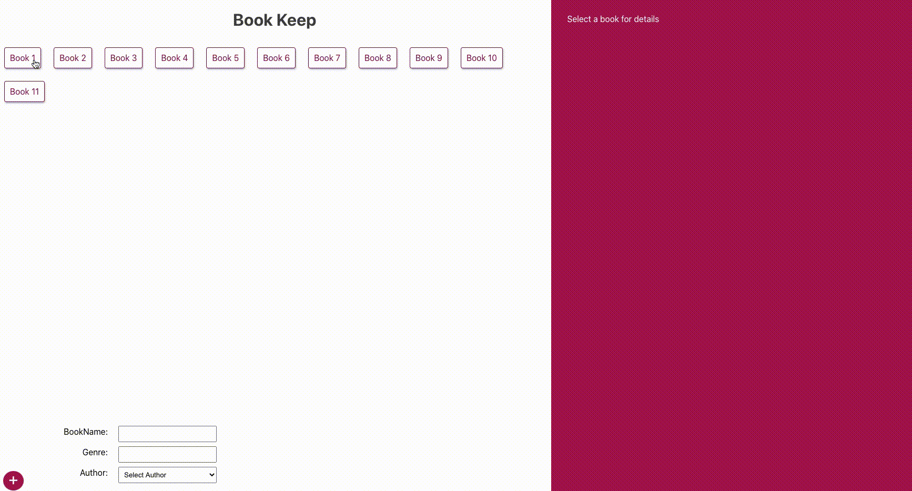

# Book Keep

An introduction to GraphQl and Apollo following [this](https://www.youtube.com/watch?v=Y0lDGjwRYKw&list=PL4cUxeGkcC9iK6Qhn-QLcXCXPQUov1U7f) tutorial.
React application using Apollo and Graph Ql to render book queries from MongoDb. 

### Key features:
* User can store a list of books storing The book title, genre and the author.
* When a user clicks a book, Info field renders with book information including list of books that the author has also written.

### Demo



### Running Instructions

> To run this application you will need to create a mongoDB database:

<details>
<summary>To create a MongoDB database</summary>
* Follow the appropriate instructions [here](https://docs.mongodb.com/manual/installation/) if you want your database to be hosted on your local machine (recommended if you just want to play around with the code).
* An alternative is to set up a remote database on a service such as Atlas, in which case follow the instructions [here](https://auth0.com/docs/connections/social/github)
</details>

<details>
<summary>To connect database to application</summary>
  To connect to your database you will need to change the following file:

  "./server/app.js"

  Change <process.env.CONNECTION_STRING> to your connection string.

  ```
    mongoose.connect(process.env.CONNECTION_STRING, { 
      useNewUrlParser: true, 
      useUnifiedTopology: true 
    });

  ```
</details>

* Install dependencies of application
  Install server dependencies
  ```
    cd server
    npm i
    // wait for dependencies to install
    cd ..
  ```

  Install client dependencies
  ```
    cd client
    npm i
    // wait for dependencies to install
    cd ..
  ```

* Run the two servers
  Run server dependencies
  ```
    cd server
    npm start
    cd ..
  ```

  Install client dependencies
  ```
    cd client
    npm start
    cd ..
  ```
